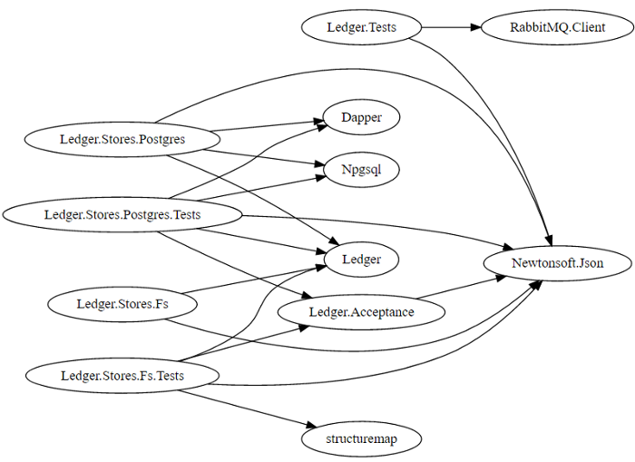

+++
date = '2016-09-12T00:00:00Z'
tags = ['c#', 'nuget', 'graphviz', 'dependencies']
title = 'Visualising NuGet Dependencies'

+++

My new place of work has a lot of nuget packages, and I wanted to understand the dependencies between them.  To do this I wrote a simple shell script to find all the `packages.config` files on my machine, and output all the relationships in a way which I could view them.

The format for viewing I use for this is [Graphviz's dot language](http://graphviz.org/doc/info/lang.html), and the resulting output can be pasted into [WebGraphviz](http://www.webgraphviz.com/) to view.

```bash
RESULT_FILE="graph.dot" # the output file
NAME_MATCH='Microsoft\.' # leave this as a blank string if you want no filtering

echo '' > $RESULT_FILE  # clear out the file
echo 'digraph Dependencies {' >> $RESULT_FILE
echo '  rankdir=LR;' >> $RESULT_FILE # we want a left to right graph, as it's a little easier to read

# find all packages.config, recursively beaneath the path passed into the script
find $1 -iname packages.config | while read line; do

  # find any csproj file next to the packages.config
  project_path="$(dirname $line)/*.csproj"

  # check it exists (e.g. to not error on a /.nuget/packages.config path)
  if [ -f $project_path ]; then

    # find the name of the assembly
    # (our projects are not named with the company prefix, but the assemblies/packages are)
    asm_name=$(grep -oP '<RootNamespace>\K(.*)(?=<)' $project_path)

    # Ignore any tests projects (optional)
    if [[ ${line} != *"Tests"* ]]; then

      # find all lines in the packages.config where the package name has a prefix
      grep -Po "package id=\"\K($NAME_MATCH.*?)(?=\")" $line | while read package; do
        # write it to the result
        echo "  \"$asm_name\" -> \"$package\"" >> $RESULT_FILE
      done

    fi
  fi

done

echo '}' >> $RESULT_FILE
```

To use this, you just need to call it with the path you want to visualise:

```bash
$ ./graph.sh /d/dev/projects/ledger
```

Note on the `grep` usage I am using a non-capturing look behind (everything before `\K`) and a non-capturing look ahead (the `(?=\")` part), as if you just use a 'normal' expression, the parts which match which I don't care about also get outputed by grep.  In C# I would have written the expression like this:

```csharp
var packageName = Regex.Match(line, "package id=\"(.*?)\"").Groups[1].Value;
```


As an example, if I run this over my directory with all of the [Ledger](https://github.com/pondidum/ledger) code in it, and filter out test dependencies (e.g. remove Shouldy, NSubstitute, Xunit), you get the following dot file:

```

digraph Dependencies {
  rankdir=LR;
  "Ledger.Acceptance" -> "Newtonsoft.Json"
  "Ledger.Tests" -> "Newtonsoft.Json"
  "Ledger.Tests" -> "RabbitMQ.Client"
  "Ledger.Stores.Postgres" -> "Dapper"
  "Ledger.Stores.Postgres" -> "Ledger"
  "Ledger.Stores.Postgres" -> "Newtonsoft.Json"
  "Ledger.Stores.Postgres" -> "Npgsql"
  "Ledger.Stores.Postgres.Tests" -> "Dapper"
  "Ledger.Stores.Postgres.Tests" -> "Ledger"
  "Ledger.Stores.Postgres.Tests" -> "Ledger.Acceptance"
  "Ledger.Stores.Postgres.Tests" -> "Newtonsoft.Json"
  "Ledger.Stores.Postgres.Tests" -> "Npgsql"
  "Ledger.Stores.Fs" -> "Ledger"
  "Ledger.Stores.Fs" -> "Newtonsoft.Json"
  "Ledger.Stores.Fs.Tests" -> "Ledger"
  "Ledger.Stores.Fs.Tests" -> "Ledger.Acceptance"
  "Ledger.Stores.Fs.Tests" -> "Newtonsoft.Json"
  "Ledger.Stores.Fs.Tests" -> "structuremap"
}
```

Which renders into the following graph:



In the process of writing this though, I did have to go back into the projects and find out why the `Ledger.Tests` was referencing `RabbitMQ.Client` (example of appending events to a queue) and why `Ledger.Stores.Fs.Tests` referened `Structuremap` (it looks like I forgot to remove the reference after rewriting how Acceptance tests were setup).

The gist with all the code in can be found here: [graph.sh](https://gist.github.com/Pondidum/a79bddeeba612f9eb1074e9f5274b047).

Hope this is useful to others too!
