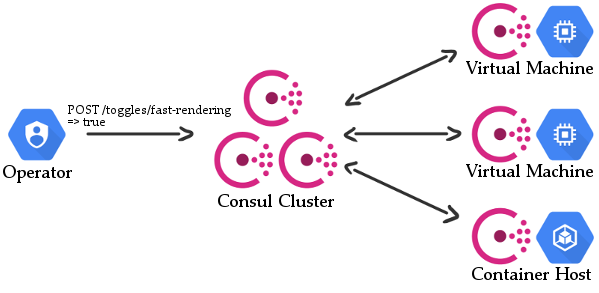

+++
date = '2018-09-06T00:00:00Z'
tags = ['microservices', 'consul', 'feature flags', 'architecture']
title = 'Feature Toggles with Consul'

+++

Feature Toggles are a great way of helping to deliver working software, although there are a few things which could go wrong.  See my talk [Feature Toggles: The Good, The Bad and The Ugly](https://www.youtube.com/watch?v=r7VI5x2XKXw) for some interesting stories and insights on it!

I was talking with a colleague the other day about how you could go about implementing Feature Toggles in a centralised manner into an existing system, preferably with a little overhead as possible.  The most obvious answer is to use a SAAS solution such as [LauchDarkly](https://launchdarkly.com/), but what if you either don't want to or can't use a SAAS solution?

What if we already are using Consul for things such as service discovery, could we use the key-value store as a basic Feature Toggle service?  It has a few advantages:

* Consul is already in place, so there is no extra infrastructure required and no additional costs
* Low stopping cost - If we decide we don't want to use Consul, or not to use Toggles at all, we can stop
*  Low learning curve - we know how to use Consul already
* Security - we can make use of Consul's [ACL](https://www.consul.io/docs/guides/acl.html#key-value-rules) to allow services to only read, and operators to write Feature Toggles.

There are also some downsides to consider too:

* We'd effectively be reinventing the wheel
* There won't be any "value protection" on the settings (nothing stopping us putting an int into a field which will be parsed as a guid for example)
* No statistics - we won't be able to tell if a value is used still
* No fine-grained control - unless we build some extra hierarchies, everyone gets the same value for a given key

So what would our system look like?



It's pretty straightforward.  We already have a Consul Cluster, and then there are several machines with Consul clients running on them, as well as a Container Host with Consul too.

Any configuration written to a Consul node is replicated to all other nodes, so our user can write values to any node to get it to the rest of the cluster.

As mentioned earlier, we can use the [ACL](https://www.consul.io/docs/guides/acl.html#key-value-rules) system to lock things down.  Our services will have a read-only role, and our updating user will have a writeable role.

## What Next?

Assuming this system covers enough of what we want to do, the next steps might be to make some incremental improvements in functionality, although again I would suggest looking into not reinventing the wheel...

### Statistics

While we can't use Consul to collect statistics on what keys are being read, we could provide this functionality by making a small client library which would log the queries and send them somewhere for aggregation.

Most microservice environments have centralised logging or monitoring (and if they don't, they really should), so we can use this to record toggle usage.

This information would be useful to have in the same place you set the feature toggles, which brings us nicely onto the next enhancement.

### User Interface

A simple static website could be used to read all the Toggles and their relevant states and statistics and provide a way of setting them.  The UI could further be expanded to give some type safety, such as extra data indicating what type a given key's value should be.

### FIne Grained Values

Currently, everyone has the same value for a given key, but the system could be expanded to be more fine-grained.  Rather than storing a feature toggle in the current form:

```
/kv/toggles/fast-rendering => true
```

We could add another level which would indicate a grouping:

```
/kv/toggles/fast-rendering/early-access => true
/kv/toggles/fast-rendering/others => false
```

At this point though, you are starting to add a lot of complexity.  Think about whether you are solving the right problem! Choose where you are spending your [Innovation Tokens](http://mcfunley.com/choose-boring-technology).

## Wrapping Up

Should you do this? Maybe. Probably not.  I don't know your system and what infrastructure you have available, so I don't want to give any blanket recommendations.

I will, however, suggest that if you are starting out with Feature Toggles, **go for something simple first**.  My current team's first use of a Feature Toggle was just a setting in the `web.config`, and we just changed the value of it when we wanted the new functionality to come on.

See what works for you, and if you start needing something more complicated than just simple key-value toggles, have a look into an existing system.