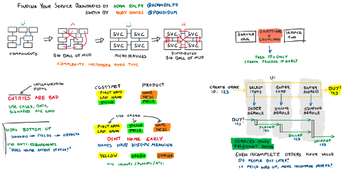

+++
date = '2018-09-10T00:00:00Z'
tags = ['sketchnotes', 'conference']
title = 'SketchNotes: Finding Your Service Boundaries'

+++

At NDC Oslo this year, I attended [Adam Ralph's](https://twitter.com/adamralph) talk on [Finding Your Service Boundaries](https://www.youtube.com/watch?v=tVnIUZbsxWI). I enjoyed it a lot, and once the video came out, I rewatched it, and decided to have a go at doing a “sketchnotes”, which I [shared on Twitter](https://twitter.com/Pondidum/status/1038807452559532032), which people liked!

I’ve never done one before, but it was pretty fun. I made it in OneNote, zoomed out a lot, and took a screenshot.

Click for huuuuge!

