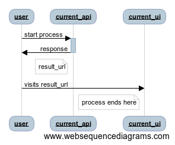
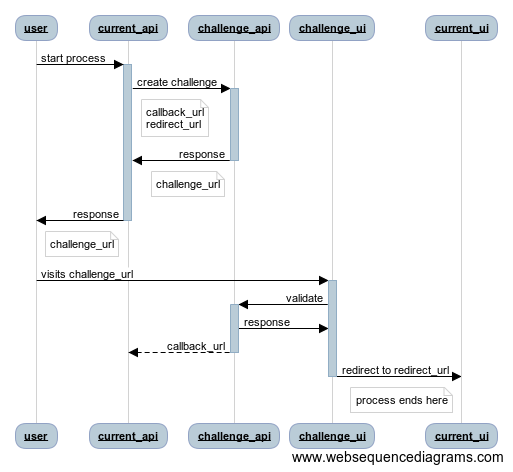

+++
date = '2018-10-28T00:00:00Z'
tags = ['architecture', 'microservices', 'design']
title = 'Microservices or Components'

+++

One of the reasons people list for using MicroServices is that it helps enforce separation of concerns.  This is usually achieved by adding a network boundary between the services.  While this is useful, it's not without costs; namely that you've added a set of new failure modes: the network. We can achieve the same separation of concerns within the same codebase if we put our minds to it.  In fact, this is what [Simon Brown](https://www.simonbrown.je/) calls a [Modular Monolith](https://www.codingthearchitecture.com/presentations/sa2015-modular-monoliths), and [DHH](https://twitter.com/dhh) calls the [Majestic Monolith](https://m.signalvnoise.com/the-majestic-monolith-29166d022228).

We recently needed to expand an existing service to have some new functionality.  The current process looks something like this, where the user has done something which will eventually return them a URL which can be clicked to get to a web page to see the results.

The new process is an additional authentication challenge which the user will need to complete before they can get to the final results page.  The new process looks like this:

## Design Decisions

Currently, the challenge functionality will only be used by this one service, but there is a high probability that we will need it for other services in the future too.  At this point we have a decision to make: do we keep this functionality in-process, or make a separate microservice for it?

### Time To Live

The first trade-off is time:  it is slightly quicker to make it in-process, but if we do want to use this from somewhere else later, we'll need to extract it; which is more work.  The key here is "if" - we don't know for sure that other services will need this exact functionality.

If we keep the new API and UI within the existing API and UI projects, we can also make some code reuse: there is a data store, data access tooling, permissions, styles that can be reused.  Also, all of our infrastructure such as logging and monitoring is already in place, which will save us some time too.

### API Risk

We want to avoid deploying a service which then needs to undergo a lot of rework in the future if the second and third users of it have slightly different requirements.  If we build it as a separate service now, will we be sure we are making something which is generic and reusable by other services?  Typically you only get the answer to this question after the second or third usage, so it seems unlikely that we would get our API design perfect on the first attempt.

### Technical Risks

If we are to go the separate service route, we are introducing new failure modes to the existing API.  What if the challenge API is down? What if the request times out? Are we using HTTP or a Message Broker to communicate with it?

If we keep the service in-process to start with we can eliminate all of these concerns.  Luckily, we tend to have very thin controllers and make use of [Mediatr](https://github.com/jbogard/MediatR), so the actual implementation of how the remote call is made can be hidden in the message handler to a certain extent.

### Technical Decisions

As alluded to in the Time To Live point, we can reuse the existing data store and data access code, but this is a tradeoff in itself: what if the current storage tech is not quite ideal for the new requirements?

If the current service makes use of a complex Entity Framework model, but the new service is so simple that Dapper makes more sense, do we introduce the new dependency or not?  What if we wanted to migrate away from one datastore to another (e.g. removing all MongoDB usage in favour of Postgres), but this is already using Mongo?  We'd be increasing our dependency on a datastore we are explicitly trying to migrate away from.

All this assumes we want to write the service in the same programming language as the existing service!  In our case we do but it's worth considering if you have multiple languages in use already.

Finally on the data storefront, if we decide to extract this as a separate service later, we will have to take into account data migrations, and how we can handle that with little if any, downtime.

## The Decision

After weighing up all these points (and a few others), we decided to keep the service inside the existing services.  The Challenge API will live in its own area in the current API, and likewise, the Challenge UI will live in its own area in the existing UI.

How do we go about keeping it all separated though?

* **Communication** we discuss all changes we want to make anyway, so the first line of defence to preventing the code becoming tightly coupled are these discussions.
* **Pull Requests** someone will notice you are doing something which is reducing the separation, and a discussion about how to avoid this will happen.
* **Naming Conventions** the Challenge API shares no naming of properties with the existing API.  For example, the current API passes in a `results_url` and `results_id`, but the Challenge API stores and refers to these as the `redirect_url` and `external_id`.
* **Readme** it'll go into the repository's readme file, along with any other notes which developers will find useful.  The sequence diagrams we drew (with much more detail) will also go in here.

## Technical Debt?

The final question on this decision is "Isn't this technical debt we are introducing?".  The answer I feel is "no", it feels much closer to applying the YAGNI Principle (You Ain't Gonna Need It).  While there is work in the backlog which can use a Challenge API at the moment, that doesn't necessarily mean it will still be there next week, or if it will be pushed further back or changed later.

In the end, the meeting where we came up with this and drew things on the whiteboard together was productive, and likely much shorter than it took me to write all this down.  We were able to resist the "cool hip microservice" trend and come up with a design which is pretty contained and composable with other systems in the future.

If after all this discussion we decided to go the MicroService route, I would still be happy with the decision, as we would have all this material to look back on and justify our choice, rather than waving our hands about and shouting "but microservices" loudly.

How do you go about designing systems?  Microservice all the things? Monolith all the things? Or something in between which makes the most sense for the situation at hand?