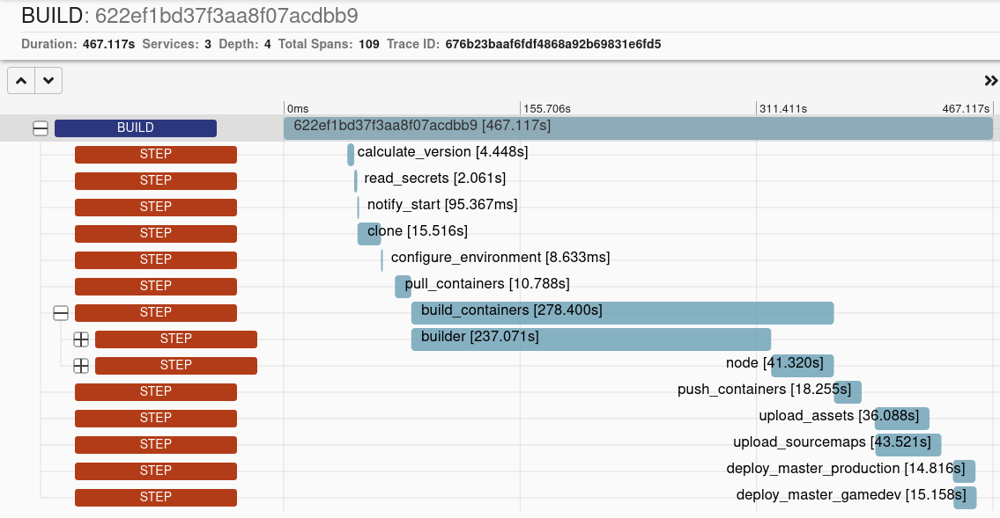
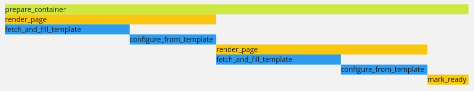

+++
title = 'Tracing: structured logging, but better in every way'
tags = [ "opentelemetry", "observability", "tracing" ]
+++

It is no secret that I am not a fan of logs; I've baited (`rapala` in work lingo.  Rapala is a Finnish brand of fishing lure, and used to mean baiting in this context) discussion in our work chat with things like:

> If you're writing log statements, you're doing it wrong.

This is a pretty incendiary statement, and while there has been some good discussion after, I figured it was time to write down why I think logs are bad, why tracing should be used instead, and how we get from one to the other.

Hopefully, with less clickbait.  Step 3 will shock you, though.

## Logs vs Traces

First, lets breakdown what I see as the key differences between logging and tracing code.  If you want the practical example and want to skip this wall of text, [click here](#evolving-logs).  There is also a short [Question and Answer](#questions--answers) at the end.

### Log Levels

Log Levels are meaningless.  Is a log line `debug`, `info`, `warning`, `error`, `fatal`, or some other shade in between?

The only time I have seen this well managed was when we had 3 descriptions:
- Info (everything)
- Create A Task for Later (e.g. this can wait for working hours)
- Wake Someone Up (this is on fire).

However, this has issues; a timeout once is "for later" or just `info`, but many timeouts might be "wake up", how do you encode that logic somewhere?

There is no equivalent of this in a trace, so there's one less thing to worry about.

### Messages

Something like ```found ${count} users in the cache``` looks like a good log message.  It is clear and has the information you care about.  However, when you come to querying your log aggregation system, you need to do a free-text search on a substring of the message or use a wildcard search.  Both of these operations are slow, and worse still cannot help you with the negative version of the question "find me operations where the cache wasn't checked".

Assuming structured logs are being used, we can at least add the `count` as a property to the log message so it can now be filtered on by the log aggregator.  At which point, why do you need the log message at all?  Why not just have `log({ users_in_cache: count })`?

The logging libraries also put more importance on the message than the properties by having it be the first (and only required) argument to the logging function.  From a querying and analysis perspective, this is wrong:  messages force you into free text searching and reduce the likelihood of fast queries on attributes.

Given this logline:

```
logger.info("found the user in the cache", userId);
```

You could reconstruct this as a statement that can be filtered on:

```
span.addAttributes({
  user_in_cache: true,
  user_id: userId,
})
```

### Mixed Outputs / Semantics

Nowadays, people configure their HTTP server to write logs to `stdout` rather than to a log file.  This makes a great deal of sense, as now a separate piece of software can tail the logs and send them off to the aggregator.  Your application's output, however, will likely end up with mixed plaintext and structured logs, mostly down to libraries and frameworks doing their own thing with logging, which is probably not the same as what you are doing (or other libraries are doing.)

The second problem with writing logs to `stdout` is that it mixes the semantics of log lines with console output.  While both log messages and console output are (probably) just text, they do have different purposes.  A piece of feedback might be "Server listening on port 3000.  Click here to open the browser".  This is useful to a local user running the app but isn't valuable in your logs.  Not to mention, its plaintext output on the console, rather than structured, so now your log tailer needs to figure out what to do with it.

With OpenTelemetry, you instead configure an `exporter` to handle all your traces (and logs and metrics, if you desire.)  This is typically sent as OTLP format either directly to a vendor or to an OTEL Collector instance, which can add/remove/modify data and send it to one or multiple places.

Now you are free to write whatever feedback you want to `stdout`.

### Relationships

Loglines don't have a causal relationships.  At best, structured logs might have some kind of request identifier (such as `requestID` or `correlationID`) for all lines written during a request.  This allows you to find all the log lines for a given ID, but the log lines themselves don't have a fixed order.  Ordering in structured logging relies on the timestamp field, but this is limited to the accuracy and resolution of the time source.  It means that it is possible to get lines appearing at the same time when they happened at different times.

Traces come with automatic parent-child relationships, allowing us to see not only all spans in a single request, but what caused each span, and (as we'll get to in the next point) when they happened.

Tracing also takes these relationships another step further but having a standard set of formats to pass trace and span IDs along to other services, embedded in HTTP headers, message queue metadata, or other locations.  Assuming all your other services send their traces to the same system, you can start to visualise who calls your service and what the effects are of you calling other services.

Imagine opening a trace from your service and discovering another team in a downstream service has started tracing their stuff, and you suddenly can see even more information about the request.  You didn't even do anything!  You notice that the way your service is structured causes a lot of load on the downstream, and start a conversation to see if there is a way to make it faster/better.


### Timings

The only timing data you get on log lines automatically is the `timestamp` of when the log line was written.  When you want to see how long an operation took, you must start a timer, and then stop the timer, and log the elapsed duration yourself.  As this is a manual process, it is often not done, and when it is done, it tends to have inconsistencies across the application, namely timing source (and thus resolution), property name, and format.  Is it `elapsed`, `elapsed_ms`, `duration`, or `length`?  does it contain a number of seconds, milliseconds, nanoseconds, or a timestamp format?

By comparison, traces come with `startTime`, `finishTime`, and `duration` attributes, which are not only guaranteed to be there but are set from the same timing source and are always written in the same format.

Combine this with the [relationship](#relationships) attributes, and you can now render timing graphs, allowing for easy visualisation of how long each part of a process takes, what can be parallelised, and what parts depend on other parts.

For example, this is a graph showing [how long a CI job took to run](/2023/07/06/observability-driven-ci/), showing all the different steps, their durations, and child steps:




### Querying

Querying can have wildly different performance characteristics depending on which log aggregation service you are using.  What unifies all these systems is their slowness, which is mostly down to vast amounts of data which needs indexing so that it can be free text searched.  Filtering logs by their structured properties is however pretty quick (usually.)

Where querying falls down is trying to find trends in data, and trying to find answers to negative queries.  For example, how would you search for "all requests to x endpoint, where users were not found in the cache"?  This requires you to group the logs by request ID, then find an entry with a particular url path, then see if it is missing a log line.  The same query in a tracing system would be `where path = "/some/api" && !user_in_cache`, as the tracing system is already aware of all the spans in a trace, and does the grouping automagically.

Finally, visualising missing data is hard.  Take this small example; it is 4 parallel requests to a system, and one of them is missing a log line.  Which line is missing?

| Timestamp | UserID       | Message                       |
|-----------|--------------|-------------------------------|
| 12:51:27  | 3fcce385be9e | fetched 3rd party preferences |
| 12:51:27  | 3fcce385be9e | found user in cache           |
| 12:51:27  | 915d273db25c | fetched 3rd party preferences |
| 12:51:27  | 3fcce385be9e | saved successfully            |
| 12:51:27  | 8507d369d11c | fetched 3rd party preferences |
| 12:51:27  | c4e71b4a29f2 | fetched 3rd party preferences |
| 12:51:27  | 915d273db25c | saved successfully            |
| 12:51:27  | c4e71b4a29f2 | found user in cache           |
| 12:51:27  | c4e71b4a29f2 | saved successfully            |
| 12:51:27  | 8507d369d11c | found user in cache           |
| 12:51:27  | 8507d369d11c | saved successfully            |

Is it easier to see the one that is different now?

| Timestamp | UserID      | Fetched | In Cache | Saved |
|-----------|-------------|---------|----------|-------|
| 12:51:27 | 3fcce385be9e |  true   |   true   |  true |
| 12:51:27 | 915d273db25c |  true   |   false  |  true |
| 12:51:27 | 8507d369d11c |  true   |   true   |  true |
| 12:51:27 | c4e71b4a29f2 |  true   |   true   |  true |

Not only is it easy to see at a glance that `915d273db25c` didn't find the user in the cache, but also how much less space this takes up (both visually and in terms of storage.)

We can also then use this to query further: show me all traces where `in_cache != true`, and see what's different about them.

## Evolving logs

So, with all that being said, let's look at a practical example of how to go about tracing an existing system and what that looks like.

Ripping all the log statements in an application in one go is not a feasible strategy, especially on a large codebase.  However, we can use logs as a decent starting place and evolve our system to something better.  Namely, to OpenTelemetry Tracing.

We'll start off with a real pair of functions from one of the codebases I work on.  Lots of information changed to protect the ~~guilty~~ innocent.  This is run as part of an api call to publish a container, but this part has no web specific code.



### Step 1: Add a Tracer

The first step is to import a tracer and start a span for each method.  As is somewhat common in Go, the methods already have a `ctx` parameter, so we just need to wrap it with the `tr.Start` call.






Just this step alone already gives us value over logging:  As mentioned above, the spans automatically come with [timing data](#timings) and [parent-child relationships](#relationships).



### Step 2: Wrap the Errors

OTEL Spans support a `status` attribute, along with a status message which is used when there is a non-success status.  By creating a small wrapper function like this:

```go
func Error(s trace.Span, err error) error {
  s.RecordError(err)
  s.SetStatus(codes.Error, err.Error())

  return err
}
```

We can wrap all error returns so that we capture the error itself (`SetStatus`) and there is an error event recorded on the trace too (`RecordError`):

```diff
if err := MarkReadyForUsage(ctx, container, templateIds); err != nil {
- return nil, err
+ return nil, tracing.Error(span, err)
}
```

### Step 3: Add Attributes and Replace Messages

The next steps is to replace any `logger` messages with attributes by turning them into statements that can be filtered on.

```diff
- logger.Info(fmt.Sprintf(`Filling %s page template`, source.Name))
+ tracing.String(span, "source_name", source.Name)
```

We also want to add attributes for any parameters we might want to filter on later.



Finally , we can simplify a code block: there is no point in the `logger.Warning` call here, as we can have all the required information as filterable properties:

```diff
+ allLocalesRendered := len(page.Locales) == len(locales)

+ tracing.Bool(span, "all_locales_rendered", allLocalesRendered)
+ tracing.StringSlice(span, "locales_rendered", page.Locales)


- if len(page.Locales) != len(locales) {
+ if !allLocalesRendered && allLocalesRequired {
+   return nil, tracing.Errorf(`Failed to render %s page template for some locales`, source.Name)
- const message = fmt.Sprintf(`Failed to render %s page template for some locales`, source.Name)
- if allLocalesRequired {
-   return nil, tracing.Errorf(message)
- } else {
-   logger.Warn(message, "locales", locales, "pages", page.Locales)
- }
}
```

### The Result

The diff between the two functions shows that the tracing version is longer - by 9 lines.  However, the traced version contains so much more information than the logged version.



If you wish to view the files as individual steps: [initial](example-api-0.go), [step 1](example-api-1.go), [step 2](example-api-2.go), [step 3](example-api-3.go), [final](example-api-4.go)


## Questions & Answers

Some questions I have seen come up when talking about doing this.

### How do I use this?

If you're debugging some error, taking the span name from your UI, and searching the codebase is a good start.  Use the attributes named in code to search your UI for things that match/don't match.

Also, try [Observability Driven Development](/presentations/index.html?odd).  It involves using your trace data before, during, and after a change so you know if its actually behaving as you expect.

### What do you recommend to view traces?

[Honeycomb](https://honeycomb.io) is the best, no question.  [Lightstep](https://lightstep.com) is a close second.

### I think this is ugly!

That is not a question.  It is also a matter of opinion - I happen to think traced code looks better than logged code.  It also could be that it takes some getting used to when you first start seeing it!  Remember how unit testing felt weird to start with?

### I need a log message...

I try to turn log messages into statements.  Like in the example above:

- `found user in cache` => `user_in_cache: true`
- `loading template ${name}` => `template_loading: true, template_name: name`

When I need to mark that code execution has gotten to a particular point in a method:

- add an attribute, like `initial_processing_complete: true`
- contemplate if the method should be split, and thus have its own span

### I have a loop, I am overwriting attributes on each iteration

Similar to above: either move the loop body into its own method, use a closure to create a new span in the loop, or don't have a span per iteration.

You can always add summary information after a loop:

```go
foos := 0
bars := 0
for i, thing := range things {
  // ...
  if thing.prop == "foo" {
    foos++
  } else {
    bars++
  }
}

tracing.SetAttribute(span, "foos", foos)
tracing.SetAttribute(span, "bars", bars)
```

## Thanks

Thanks to [Aki](https://fi.linkedin.com/in/aki-foudila-339222200) for some of the questions and some discussions which expanded a few of the sections here.

Thanks to [Lari](https://www.tuomistolari.net/) for prompting this blog post initially!

Thanks to you, for making it to the end.
